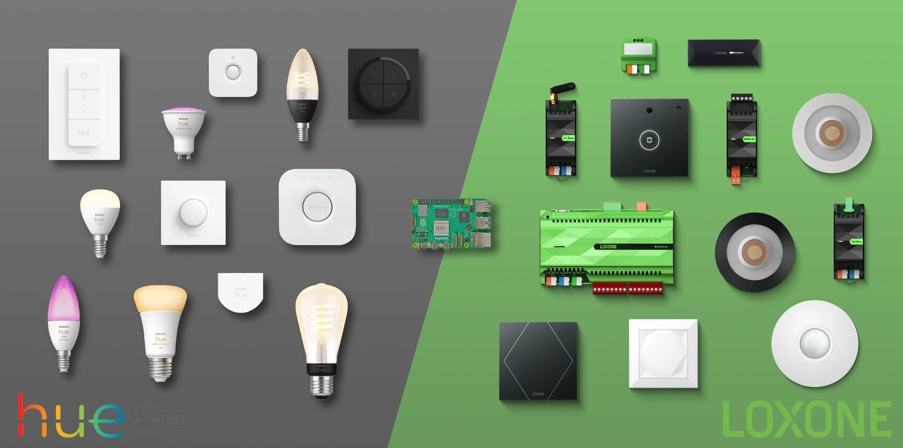
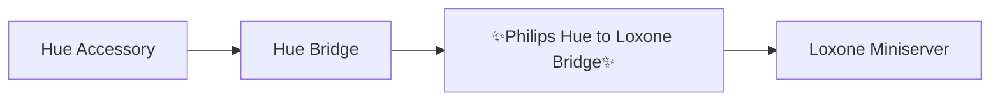

<p align="center">
  
</p>

[](http://hits.dwyl.com/marcelschreiner/hue-to-loxone)


# Philips Hue to Loxone Bridge
This python script allows you to integrate your Philips Hue smart lighting system with your Loxone system. By running this script, events in the Hue system are forwarded to the Loxone Miniserver in the form of UDP packets. The signal-flow is like this:

```mermaid
graph LR
    A[Hue Accessory] --> B[Hue Bridge]
    B --> C[✨Philips Hue to Loxone Bridge✨]
    C --> D[Loxone Miniserver]
```

> [!NOTE]
> This Python script only sends events from the Hue bridge to the Loxone Miniserver. If you want to control your Hue lights from the Miniserver, have a look at [this PicoC script](https://github.com/marcelschreiner/loxone-hue-picoc) that can run on the Miniserver.

<br/>

## Features
- **Event forwarding:** Button presses, motion, light level, temperature, battery level and (optionally) light and group states are sent to the Miniserver as soon as they happen.
- **Motion polling:** All motion sensors are additionally polled every minute. If an event ever gets lost, the state in Loxone is corrected within a minute.
- **Auto reconnect:** If the Hue bridge is unreachable (e.g. after a reboot or a network outage), the script keeps retrying instead of crashing.
- **Less traffic:** Light and group states can be turned off, so the Miniserver only receives sensor data and button presses.
<br/>

## Supported Event Types
The bridge is designed to parse the following events. (If you are missing an event type, hit me up and we'll see if i can add it 😎)

| Event Type | Description |
| --- | --- |
| `BUTTON` | This event is triggered when a button on a Hue Dimmer Switch, Hue Button or an other similar device is pressed. The button_state is `1` as long as the button is pressed and `0` when released. <br/><br/>Note that for BUTTON events, the `{item_state}` has a format of `{button_number}/{button_state}`. This is because a single hue accessory can have multiple buttons. <br/><br/> Example: `hue_event/sensors/29/1/1`|
| `MOTION` | This event is triggered when motion is detected by a Hue motion sensor. The state is `1` when motion is detected and `0` when no motion is detected. The state of all motion sensors is additionally sent every minute (see `MOTION_POLL_INTERVAL`). <br/><br/> Example: `hue_event/sensors/34/1`|
| `LIGHT_LEVEL` | This event is triggered when the light level measured by a Hue motion sensor changes. The state represents the current light level in Lux. <br/><br/> Example: `hue_event/sensors/35/230` = 230 Lux |
| `TEMPERATURE` | This event is triggered when the temperature changes on a Hue motion sensor. The state represents the current temperature as a float value. <br/><br/> Example: `hue_event/sensors/36/25.36` = 25.36°C|
| `LIGHT` | This event is triggered when the state of a light changes. The state is `1` when the light is on and `0` when the light is off. Only sent if `SENSORS_AND_BUTTONS_ONLY = False`. <br/><br/> Example: `hue_event/lights/4/1`|
| `GROUPED_LIGHT` | This event is triggered when the state of a light group changes. The state is `1` when the group is on and `0` when the group is off. Only sent if `SENSORS_AND_BUTTONS_ONLY = False`. <br/><br/> Example: `hue_event/groups/3/0`|
| `DEVICE_POWER` | This event is triggered when the battery level of a Hue device changes. The state represents the current battery level. |

Each event is sent to the Loxone Miniserver as a UDP packet in the format `{EVENT_PREFIX}/{item_type}/{item_id}/{item_state}` (default prefix: `hue_event`). Every Hue item has a unique id. If an item can have multiple different event types, then a unique id for every event type is generated.

To make it easier for you to assign the id to a specific item, the python script prints all names and id's during startup (and refreshes them every hour). In the log, events are marked with `EVENT:` and polled values with `POLL:`.
<br/><br/>

## Getting Started
This guide assumes that you have git and python 3 installed on your system. If true, continue with these steps:

1. Clone this repository.
   ```shell
   git clone https://github.com/marcelschreiner/hue-to-loxone.git
   ```

2. Install the required dependencies (python libraries) with pip. `pip3` is traditionally used on Raspberry Pis to install libraries for Python 3, other systems may use `pip`.
   ```shell
   pip3 install requests
   pip3 install aiohue
   ```

3. Generate a Philips Hue API key to access your Hue bridge. To do this, configure the IP of your Hue bridge in `get_api_key.py`. Then execute the script, it will guide you through the process.
   ```shell
   python3 get_api_key.py
   ```

4. Modify the configuration variables in the `hue2lox.py` script as described in the [Configuration](#configuration) section.

5. Run the Philips Hue to Loxone bridge using the following command:
   ```shell
   python3 hue2lox.py
   ```

6. OPTIONAL: *(Example for Raspberry Pi)* If you want the python script to automatically start if your system starts, open `rc.local`
   ```shell
   sudo nano /etc/rc.local
   ```
   Then add the path to the `hue2lox.py` script:
   ```
   ...
   python3 /home/pi/hue2lox.py &
   exit 0
   ```

## Configuration
Open the script and modify the following variables to match your setup:

| Variable | Default | Description |
| --- | --- | --- |
| `HUE_IP` | | IP address of your Philips Hue bridge. |
| `HUE_API_KEY` | | API key of your Hue bridge (see step 3 above). |
| `LOXONE_IP` | | IP address of your Loxone Miniserver. |
| `LOXONE_UDP_PORT` | | UDP port your Loxone Miniserver is listening on. |
| `EVENT_PREFIX` | `hue_event` | Prefix of the UDP messages. |
| `SENSORS_AND_BUTTONS_ONLY` | `True` | If `True`, only sensor data and button presses are sent. Set to `False` to also send light and group states. |
| `RETRY_DELAY` | `30` | Seconds to wait before reconnecting if the Hue bridge is unreachable. |
| `MOTION_POLL_INTERVAL` | `60` | Seconds between polling all motion sensors. |

> [!TIP]
> Leave `SENSORS_AND_BUTTONS_ONLY` on `True` unless you need light states in Loxone. Every brightness or color change of a light triggers an event for the light, each of its groups and "All lights", which can result in a lot of UDP packets.

<br/>

## Configuring a Virtual UDP Input in Loxone Config
To integrate the Philips Hue events with your Loxone Miniserver, you need to configure a virtual UDP input in the Loxone Config. Follow the steps below:

1. Open the Loxone Config and connect to your Miniserver.

2. Navigate to the `Periphery` tree in the structure view.

3. Right-click on the `Virtual Inputs` and select `Add Virtual UDP Input`.

4. In the properties of the newly created Virtual UDP Input, set the `UDP Command` to for example `hue_event/sensors/42/\v`.
<br/><br/>

## License
Released under the [MIT License](LICENSE.md), this code is yours to command! 🚀 Modify it, tweak it, use it to your heart's content. Let's create something amazing together! 💻🌟
